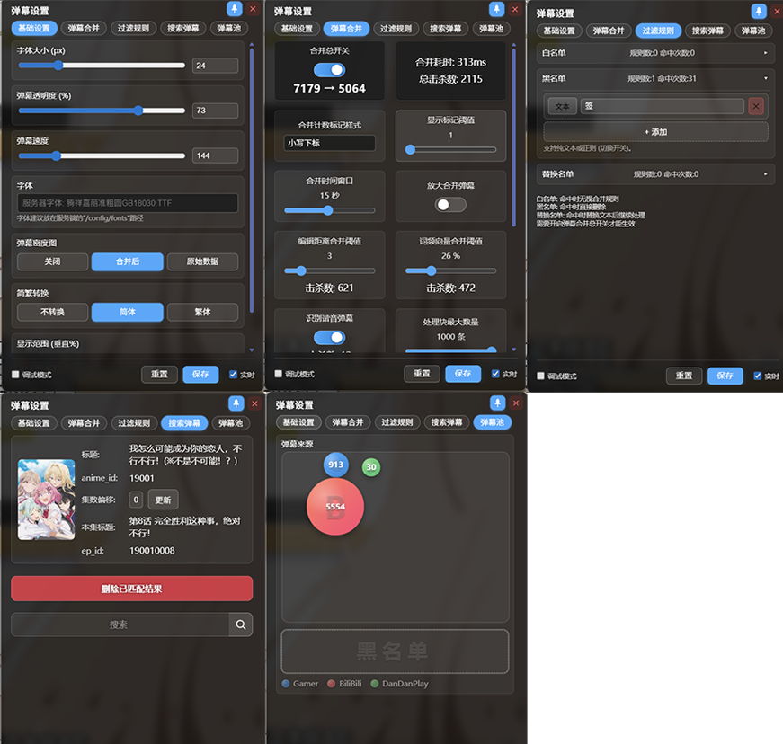
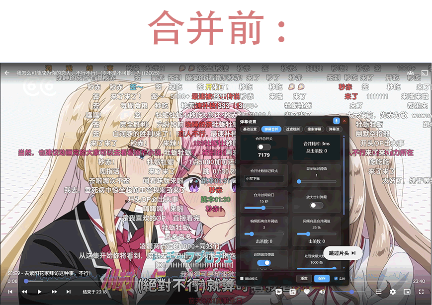
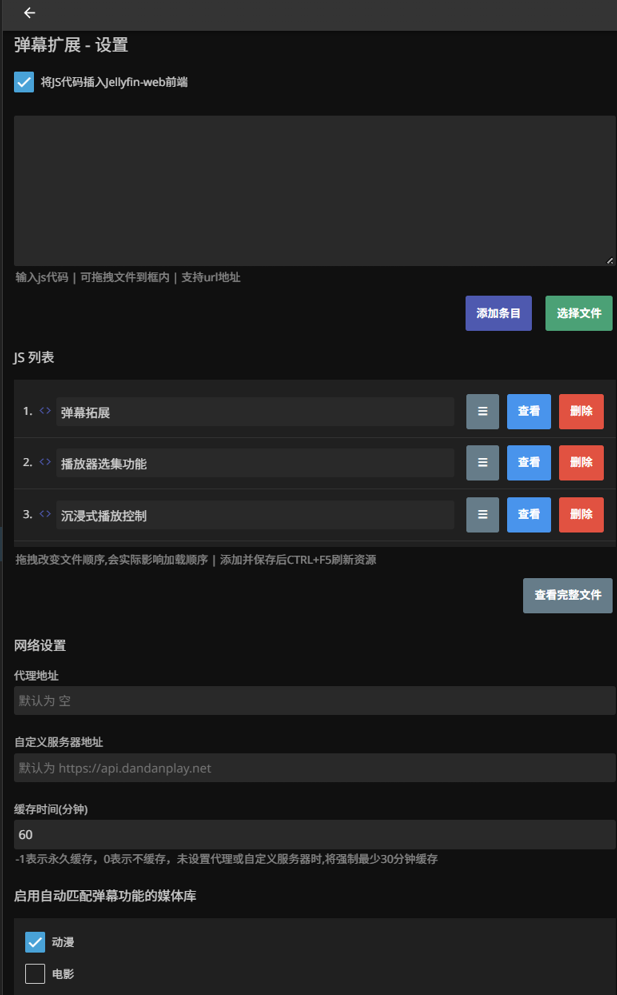

# Jellyfin 弹幕拓展插件 Jellyfin.Plugin.DanmakuExtension

对项目 https://github.com/Izumiko/jellyfin-danmaku 的重写与增强。

jellyfin版本为10.10.7,未测试其他版本的兼容情况

## 功能 / 改进

- 服务器插件
	- 以 Jellyfin 服务器插件的形式，提供“向 jellyfin-web 注入前端代码”的可视化配置入口。
	- 网络请求缓存与用户设置持久化。
	- 弹幕与媒体的自动匹配，并保存匹配信息。
	- 将弹幕数据格式化和样式处理迁移到后端。
	- 弹幕数据的合并预处理（思路参考/复刻自 https://github.com/xmcp/pakku.js ）。

- 前端 JS
	- 全新的设置界面。
	- 进度条显示弹幕密度图。
	- 读取 Jellyfin 服务器中已安装字体作为弹幕字体选项。(字体文件建议放在"/config/fonts"中)
	- 实时预览修改参数。
	- 进度跳转时回填历史弹幕，实现近似“逐帧”观感。
	- 右键弹幕可弹出复制菜单。

## 安装与使用

1) 部署插件 DLL
- 在 Jellyfin 服务器的 plugins 目录中新建一个子目录。
- 将仓库根目录中的 `Jellyfin.Plugin.DanmakuExtension.dll` 复制到该目录。
- 重启 Jellyfin 服务器。

2) 注入前端脚本
- 打开 Jellyfin 控制台 → 我的插件 → Danmaku Extension
- 将仓库根目录中的 `jellyfin-danmaku.min.js` 拖入或粘贴内容到输入框。
- 点击“添加条目”，保存设置。
- 在浏览器中按下 Ctrl+F5 强制刷新缓存。

## 效果预览

## TODO

- 渲染哔哩哔哩直播的表情图片弹幕。
- 登录dandanplay,发送弹幕
